# ?? GitHub Pages Deployment - Setup Complete!

## ? What's Been Configured

Your KeryxPars Message Viewer is now **fully configured** for GitHub Pages deployment!

### **Files Created:**

1. **`.github/workflows/deploy-gh-pages.yml`**
   - Automated CI/CD pipeline
   - Builds and deploys on every push to master/main
   - Updates base path automatically
   - Handles SPA routing

2. **`wwwroot/.nojekyll`**
   - Prevents GitHub from processing files with Jekyll
   - Essential for Blazor WASM apps

3. **`wwwroot/404.html`**
   - Handles client-side routing for SPAs
   - Redirects deep links back to index.html
   - Enables direct navigation to `/viewer`, `/library`, etc.

4. **Updated `wwwroot/index.html`**
   - Added SPA redirect handling script
   - Processes query parameters from 404.html
   - Maintains navigation state

5. **`publish-gh-pages.sh`** & **`publish-gh-pages.bat`**
   - Local publishing scripts (Linux/Mac & Windows)
   - Build, publish, and prepare for deployment
   - Useful for testing before pushing

6. **`DEPLOYMENT.md`**
   - Complete deployment instructions
   - Troubleshooting guide
   - Configuration details

---

## ?? Next Steps

### **1. Enable GitHub Pages**

Go to your repository settings:

1. Navigate to: `https://github.com/theelevators/KeryxPars/settings/pages`
2. Under **Source**, select: `GitHub Actions`
3. Click **Save**

### **2. Push to GitHub**

```bash
# Add all new files
git add .

# Commit changes
git commit -m "Add GitHub Pages deployment configuration"

# Push to GitHub
git push origin master
```

### **3. Wait for Deployment** (2-5 minutes)

1. Go to **Actions** tab: `https://github.com/theelevators/KeryxPars/actions`
2. Watch the **Deploy to GitHub Pages** workflow
3. Once complete, your app will be live!

### **4. Access Your App**

Your live app will be available at:

**?? https://theelevators.github.io/KeryxPars/**

---

## ?? Configuration Details

### **Base Path**

The GitHub Actions workflow automatically sets the base path to `/KeryxPars/`:

```html
<base href="/KeryxPars/" />
```

This ensures all assets load correctly from the GitHub Pages subdirectory.

### **SPA Routing**

The 404.html redirect handles routes like:
- `/KeryxPars/viewer` ? Loads the viewer page
- `/KeryxPars/library` ? Loads the library page
- `/KeryxPars/viewer?messageId=123` ? Loads specific message

### **Automated Deployment**

Every push to `master` or `main` triggers:
1. ? Restore dependencies
2. ? Build solution
3. ? Publish Blazor WASM
4. ? Update base path
5. ? Create 404.html copy
6. ? Add .nojekyll
7. ? Deploy to GitHub Pages

---

## ?? Local Testing

### **Option 1: Test with Production Base Path**

Temporarily update `index.html`:
```html
<base href="/KeryxPars/" />
```

Run:
```bash
cd KeryxPars.MessageViewer/KeryxPars.MessageViewer.Client
dotnet watch
```

Access: `http://localhost:5000/KeryxPars/`

**Remember to revert to `<base href="/" />` after testing!**

### **Option 2: Use Publish Scripts**

**Windows:**
```cmd
publish-gh-pages.bat
```

**Linux/Mac:**
```bash
chmod +x publish-gh-pages.sh
./publish-gh-pages.sh
```

Then serve the `publish/wwwroot` folder with any web server.

---

## ?? Deployment Workflow

```mermaid
graph LR
    A[Push to GitHub] --> B[GitHub Actions Trigger]
    B --> C[Restore KeryxPars Solution]
    C --> D[Build Solution]
    D --> E[Publish MessageViewer.Client]
    E --> F[Update Base Path]
    F --> G[Create 404.html]
    G --> H[Add .nojekyll]
    H --> I[Upload Artifact]
    I --> J[Deploy to GitHub Pages]
    J --> K[Live on GitHub.io! ??]
```



---

## ?? Troubleshooting

### **Issue: Workflow doesn't trigger**

**Solution:** Make sure GitHub Pages is set to "GitHub Actions" source.

### **Issue: 404 on all pages**

**Solution:** Verify `.nojekyll` file exists in published output.

### **Issue: Assets not loading**

**Solution:** Check that base path is correctly set to `/KeryxPars/`.

### **Issue: Deep links return 404**

**Solution:** Ensure `404.html` has the redirect script.

---

## ?? Customization

### **Change Repository Name**

If you rename the repository, update the base path in the workflow:

```yaml
# In .github/workflows/deploy-gh-pages.yml
- name: Update base tag
  run: sed -i 's/<base href="\/" \/>/<base href="\/YOUR-NEW-NAME\/" \/>/g' publish/wwwroot/index.html
```

### **Custom Domain**

To use a custom domain:

1. Add `CNAME` file to `wwwroot/`:
   ```
   yourdomain.com
   ```

2. Configure DNS:
   ```
   CNAME: theelevators.github.io
   ```

3. Update base path to:
   ```html
   <base href="/" />
   ```

---

## ?? What Gets Deployed

```
GitHub Pages Root: /
??? KeryxPars/                    # Your app root
    ??? index.html               # Main entry
    ??? 404.html                 # SPA routing
    ??? .nojekyll                # No Jekyll
    ??? css/                     # Styles
    ??? lib/                     # Bootstrap, etc.
    ??? _framework/              # Blazor framework
    ?   ??? blazor.webassembly.js
    ?   ??? dotnet.*.wasm
    ?   ??? *.dll                # Your compiled app
    ??? sample-data/             # Sample data
```

---

## ?? Success Checklist

- ? GitHub Pages enabled with "GitHub Actions" source
- ? `.nojekyll` file in wwwroot
- ? `404.html` configured for SPA routing
- ? `index.html` has redirect script
- ? GitHub Actions workflow created
- ? Base path configured for `/KeryxPars/`
- ? All files committed and pushed

---

## ?? Ready to Deploy!

Once you push to GitHub, your workflow will:
1. Automatically build the app
2. Deploy to GitHub Pages
3. Make it live at: **https://theelevators.github.io/KeryxPars/**

**No further configuration needed - just push and watch it deploy!** ??

---

## ?? Need Help?

- Check the [DEPLOYMENT.md](KeryxPars.MessageViewer/DEPLOYMENT.md) for detailed instructions
- Review GitHub Actions logs for build errors
- Open an issue if you encounter problems

---

**Happy Deploying! ??**
